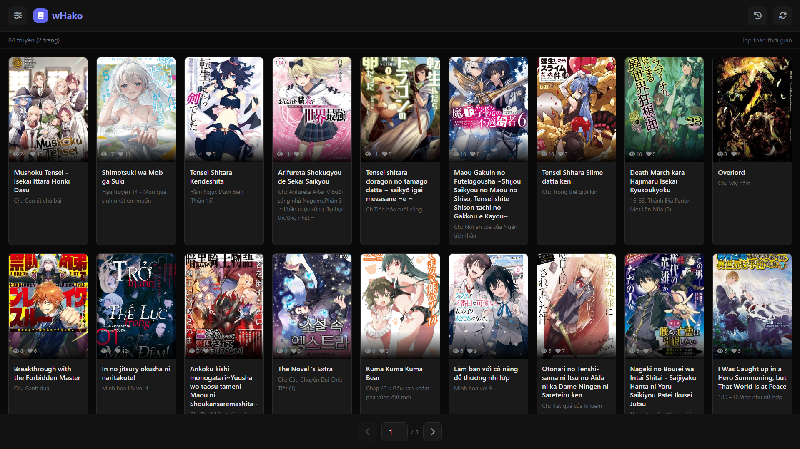
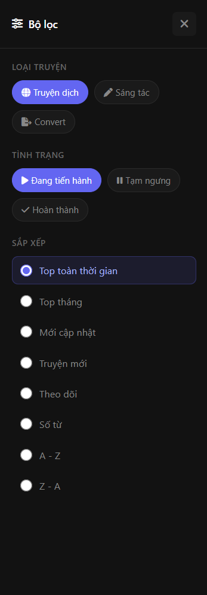
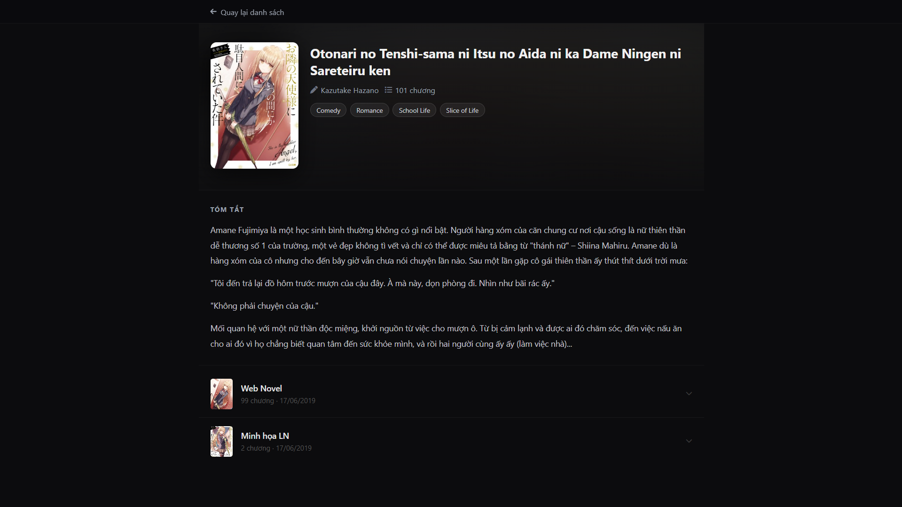
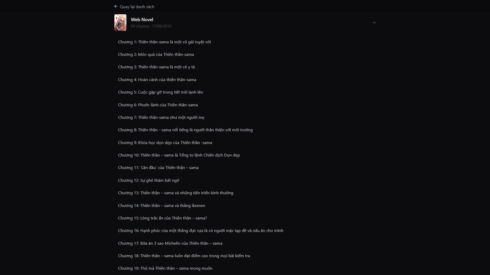
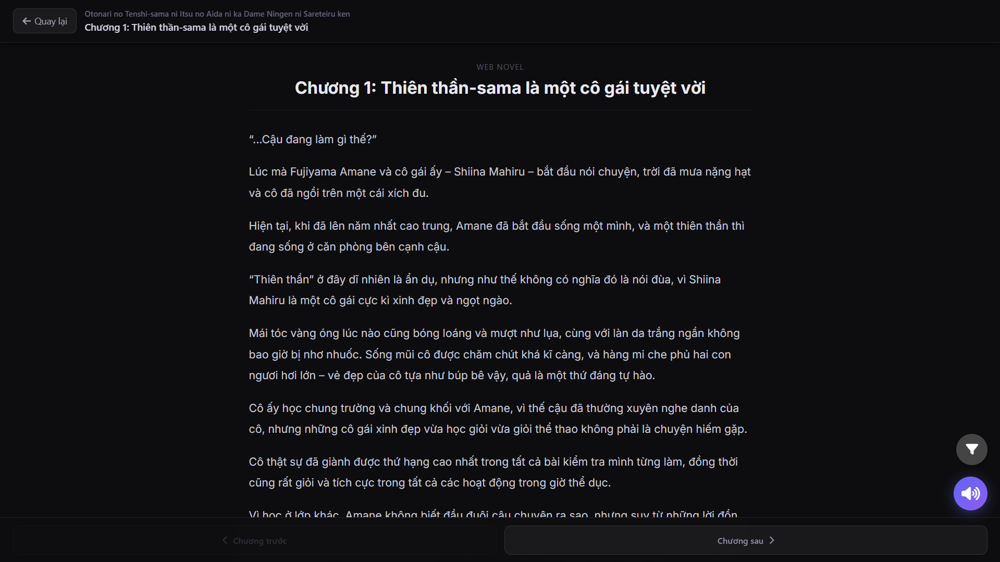
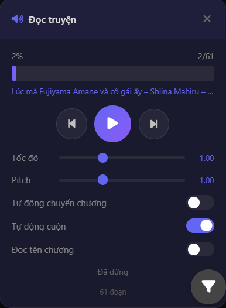
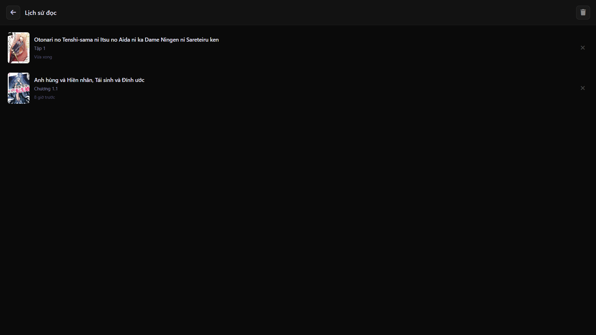
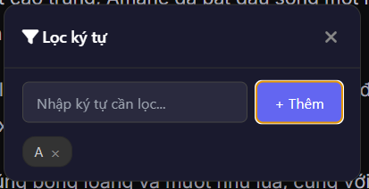

# wHako - Đọc Light Novel Online

Ứng dụng Electron desktop để đọc light novel tiếng Việt trực tuyến từ **docln.sbs**, hỗ trợ TTS và lịch sử đọc.

## Tính năng

- **Đọc light novel** với giao diện dark mode mượt mà
- **Text-to-Speech (TTS)** - nghe truyện tự động bằng Google Translate
- **TTS nâng cao** - điều chỉnh tốc độ, cao độ giọng nói
- **Image cache** - lưu hình ảnh trong RAM (LRU, tối đa 500MB)
- **Lịch sử đọc** - lưu tiến độ, tự động ghi nhận thời gian đọc
- **Infinite scroll** - duyệt truyện không giới hạn

## Hình ảnh

| Màn hình | Mô tả |
|----------|-------|
|  | **Trang chủ** - Danh sách truyện với infinite scroll |
|  | **Bộ lọc** - Lọc truyện theo thể loại |
|  | **Chi tiết truyện** - Thông tin và danh sách chương |
|  | **Mục lục** - Danh sách các chương |
|  | **Trình đọc** - Giao diện đọc truyện |
|  | **TTS** - Nghe truyện với giọng đọc tự động |
|  | **Lịch sử** - Tiến độ đọc các truyện |
|  | **TTS Filter** - Bộ lọc cho chế độ TTS |

## Cài đặt

```bash
# Cài đặt dependencies
npm install

# Chạy development
npm run dev

# Build cho nền tảng hiện tại
npm run build

# Build cho Windows / macOS / Linux
npm run build:win
npm run build:mac
npm run build:linux
```

## Yêu cầu

- Node.js 18+
- Electron 41+

## Cấu trúc dự án

```
wHako/
├── src/
│   ├── main/                  # Electron main process
│   │   ├── main.js           # Window, menu, auto-updater
│   │   ├── scraper.js        # HTTP fetching, HTML parsing, IPC handlers
│   │   └── utils/
│   │       ├── constants.js   # Hằng số (MAX_RETRIES, CACHE_SIZE...)
│   │       ├── crypto.js      # Giải mã nội dung chapter (XOR/shuffle)
│   │       ├── history.js     # Lưu lịch sử đọc (JSON)
│   │       ├── imageCache.js  # In-memory cache hình ảnh (LRU 500MB)
│   │       └── sanitizer.js   # Sanitize HTML
│   ├── preload/
│   │   └── preload.js        # Context bridge cho IPC
│   └── renderer/              # Giao diện (vanilla JS, Tailwind CDN)
│       ├── index.html        # Entry point
│       ├── app.js            # Root orchestrator
│       ├── components/
│       │   ├── navbar.js     # Sidebar, header, pagination
│       │   ├── home.js       # Comic list, infinite scroll
│       │   ├── detail.js     # Chi tiết truyện, danh sách chapter
│       │   ├── reader.js     # Reader (lazy-loaded khi mở chapter)
│       │   ├── history.js    # Màn hình lịch sử đọc
│       │   └── tts.js        # TTS via Web Audio API
│       ├── core/
│       │   ├── state.js      # Global state (window.AppState)
│       │   └── utils.js      # Utilities (escHtml, formatNumber...)
│       └── styles/
│           ├── styles.css    # Main styles
│           └── reader.css    # Reader styles
├── assets/                   # Icon ứng dụng
├── package.json
└── README.md
```

## IPC Flow

```
Renderer (window.electronAPI.*)
    ↓ ipcRenderer.invoke
Preload (contextBridge)
    ↓ ipcMain.handle
Main Process (scraper.js)
    ↓ HTTP
docln.sbs
```

| Handler | Mô tả |
|---------|-------|
| `scrape-page` | Lấy danh sách truyện |
| `scrape-detail` | Lấy chi tiết truyện, danh sách chapter |
| `scrape-chapter` | Lấy nội dung chapter (đã giải mã) |
| `tts-google` | Fetch audio TTS |
| `history-get/add/remove` | Quản lý lịch sử đọc |

## Cấu hình

Tạo file `.env` để thay đổi base URL:

```env
BASE_URL=https://docln.sbs
```

## Tech Stack

- **Electron 41** - Desktop framework
- **axios** - HTTP client
- **electron-updater** - Auto-update
- **Tailwind CSS** (CDN) - Styling
- **Vanilla JS** - Không bundler, không framework

## License

MIT
